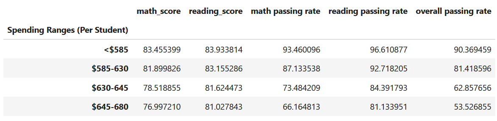
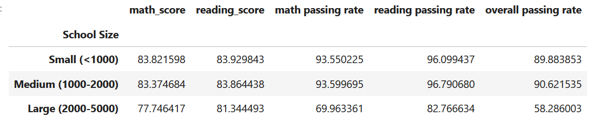
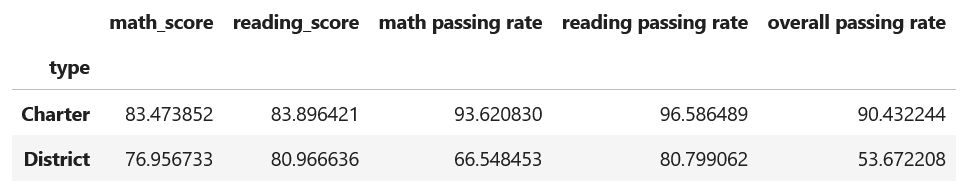

Written Report

Based on the data analysis in this Jupyter Notebook that analyzed the data from district and charter schools in the area, I have found the following results:  

We have a total of 15 unique schools, containing 39,170 students, and a total budget of $24.6M for all of those schools and students. Ocerall, the students have a passing reading and math score, and over 65% of the students are passing overall. I analyzed the data further to see any differences or discrepancies between the schools themselves, the grade levels, and the differences in scores by spending, school size, and school type. 

I found the top 5 scoring schools, and the bottom 5 schools in performace. It was interesting to note that the top schools were all charter schools, and the bottom schools were all district schools.  Math and reading scores by grade did not seem to be significantly different. 

I did find, however, that the top spending school had one of the lowest overall passing rates. We looked at spending per student (per capita) and found that the lower per capita rates had higher overall passing rates. 

I also looked at perfomance based on the size of the school and found that the overall passign rate was highest for medium schools, then small schools, then large schools had the lowest overall passing rate. 

Finally, looking at the type of schools, I noticed that the overall passign rate was highest for charter schools, and the district overall passing rate was rather low. 

Moving forward, I recommend the district looks into maintining smaller schools, and instead of necessarily pouring more money into the schools, try to find out the differences between the charter and disctict approaches to learning. 

Here are some of the relevent charts: 

